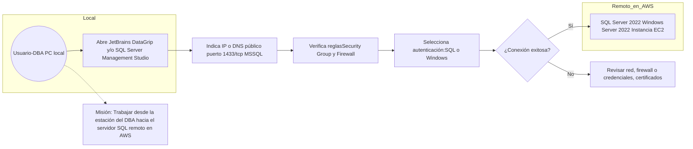

<a href="https://cooltext.com"></a>
<br />Image by <a href="https://cooltext.com">Cool Text: Free Graphics Generator</a> - <a href="https://cooltext.com/Edit-Logo?LogoID=4801693220">Edit Image</a>

# Utilice jetbrains.com DataGrip y/o  SQL Server Manager Studio para acceder a el servidor AWS-MSServer Remoto 1433/tcp para comunicarse con SQL Server 2022 

# 🧑‍🏫 Lección: Implementación de Windows Server en AWS EC2 con SQL Server y Consulta Remota desde Cliente Local

### 🎯 Objetivos de Aprendizaje (Learning Objectives)
- Implementar una instancia EC2 con Windows Server y SQL Server.
- Importar datos ficticios desde Mockaroo.
- Configurar SQL Server para acceso remoto.
- Configurar reglas de seguridad (firewall) en AWS para permitir acceso desde IP externa.
- Realizar una conexión remota desde SQL Server Management Studio (SSMS) en su PC local.
- Documentar el proceso en una grabación con LOOM.

---

## 🧰 Requisitos Previos

1. Cuenta activa de AWS Academy.
2. SQL Server Management Studio (SSMS) instalado en equipo local.
3. Cuenta gratuita de LOOM.
4. Acceso a [http://WhatsMyIp.com](http://[whatsismyip](https://www.whatismyip.com) para obtener IP externa.
5. Acceso a [http://fabricate.mockaroo.com](http://fabricate.mockaroo.com) para generar datos ficticios.

---

---

## 🪜 Paso a Paso

### 1. Crear instancia EC2 con Windows Server y SQL Server

- **AMI sugerida:** Microsoft Windows Server 2022 Base with SQL Server Web.
- **Tipo de instancia:** t2.medium o superior con 8 Gb RAM
- **Almacenamiento:** mínimo 30 GB (C:).
- **Nombre de clave (key pair):** generar uno nuevo o reutilizar existente para RDP.
- **Grupo de seguridad:**
  - Inbound rules:
    - RDP: TCP 3389 desde *My IP*
    - SQL Server: TCP 1433 desde *My IP*

### 2. Conectar por RDP a la instancia

- **Descargar archivo `.rdp`** desde AWS Console.
- Usar contraseña de administrador obtenida mediante clave PEM.

### 3. Habilitar SQL Server para conexiones remotas

Dentro del servidor (vía RDP):

- Abrir **SQL Server Configuration Manager**:
  - Habilitar **TCP/IP** en "SQL Server Network Configuration".
  - En propiedades de TCP/IP, verificar puerto 1433.
- Reiniciar el servicio de SQL Server.

### 4. Crear base de datos y cargar datos ficticios

- Desde [http://fabricate.mockaroo.com](http://fabricate.mockaroo.com):
  - Diseñar un esquema (ej. `clientes`, `ventas`, etc.).
  - Descargar en formato `.csv`.
- En SSMS (dentro del servidor):
  - Crear base de datos: `CREATE DATABASE DemoDB;`
  - Crear tablas e importar CSV:
    ```sql
    BULK INSERT DemoDB.dbo.Clientes
    FROM 'C:\Users\Administrator\Downloads\clientes.csv'
    WITH (
        FIELDTERMINATOR = ',',
        ROWTERMINATOR = '\n',
        FIRSTROW = 2
    );
    ```

### 5. Configurar IP del cliente en el Security Group

- Ir a checar la ip en su computadora local.
- Copiar IP pública.
- En el **Security Group** de EC2:
  - Editar Inbound Rules → Agregar TCP 1433 desde la IP obtenida (formato: `X.X.X.X/32`).

### 6. Conectarse desde SSMS en la computadora local

- Abrir SSMS.
- En "Server name": `X.X.X.X,1433` (IP pública de la EC2).
- Autenticación: SQL Server Authentication (crear login en SQL Server si no se usa el de Windows).
- Verificar acceso y ejecutar consulta de prueba:
  ```sql
  SELECT TOP 10 * FROM DemoDB.dbo.Clientes;
  ```

---

## 🎥 Entrega de Video en LOOM

**Contenido mínimo del video (1 hasta 5 minutos):**
1. Acceso a la instancia EC2 vía RDP.
2. Configuración del firewall con IP pública.
4. Conexión desde SSMS y/o DataGrip en su PC local.
5. Ejecución de una consulta.
6. Mostrar para validar IP de su estacion.
   NOTA: Ud. logro accceder a cualquier server SQL del mundo y trabajar desde su PC
   ¿Que paso con los formularios, etc? estos estaran en el servidor via Aplicacion Web de ASP.net c#

---

## ✅ Criterios de Evaluación

| Criterio                        | Peso |
|-------------------------------|------|
| Instancia funcional            | 20%  |
| Importación de datos correcta | 20%  |
| Configuración de red segura   | 20%  |
| Conexión remota exitosa       | 20%  |
| Entrega clara en LOOM         | 20%  |

---

Para conectar JetBrains DataGrip o SQL Server Management Studio (SSMS) a una instancia de SQL Server 2022 en AWS (corriendo sobre Windows Server 2022 con SQL Server 2022 Web), se puede contemplar lo siguiente:

• **Configuración en AWS**  
   - Verificar que el puerto 1433/TCP esté abierto en el grupo de seguridad (Security Group) asociado a la instancia de Windows Server 2022, habilitando las reglas de entrada (inbound rules) para permitir conexiones entrantes en el puerto 1433.  
   - Anotar la dirección IP pública o el DNS público de la instancia de Windows Server. Esa información se muestra en el panel de EC2, en la sección de “Description”, como “Public DNS” o “Elastic IP” (en caso de estar asignada).

• **Acceso por SQL Server Management Studio (SSMS)**  
   - En “Server name” o “Nombre del servidor” se ingresa la IP o DNS público seguido del puerto (si fuera necesario especificarlo explícitamente). Por ejemplo: `mi-direccion-publica:1433`.  
   - Seleccionar el tipo de autenticación correspondiente (SQL Server Authentication o Windows Authentication si hay un dominio/Active Directory con VPN).  
   - Ingresar las credenciales del usuario de SQL Server habilitado para conexiones remotas.  
   - Asegurarse en las propiedades de SQL Server (a través de SQL Server Configuration Manager en la instancia remota) que “TCP/IP” esté habilitado y configurado para el puerto 1433.

• **Acceso por JetBrains DataGrip**  
   - En DataGrip, dentro de “Database Explorer” -> “Data Sources and Drivers”, crear una nueva conexión de tipo “Microsoft SQL Server”.  
   - En “Host” colocar la dirección pública o el DNS de la instancia. En “Port” colocar 1433.  
   - En “Database” se puede dejar en blanco para que muestre todas las disponibles, o colocar directamente la base de datos predeterminada.  
   - Seleccionar el tipo de autenticación (generalmente “User & Password” para SQL Server Authentication).  
   - Habilitar la casilla de “SSL” si fuera necesario (por ejemplo, si el servidor está configurado con un certificado SSL/TLS).  
   - Probar la conexión y, si es correcto, DataGrip indicará “Successful”.

• **Consideraciones adicionales**  
   - Comprobar que el firewall de Windows en la instancia de AWS no bloquee el puerto 1433.  
   - Revisar las propiedades de la instancia de SQL Server para que acepte conexiones remotas (se configura en “SQL Server Network Configuration” habilitando “TCP/IP”).  
   - En SQL Server Management Studio se puede verificar la autenticación mixta (Windows y SQL Server logins) en las propiedades del servidor, opción “Security”.  
   - Asegurarse de tener las credenciales del usuario sa (o el usuario de SQL Server habilitado) que cuente con los permisos adecuados para conectarse remotamente.

De esa forma tanto JetBrains DataGrip como SQL Server Management Studio podrán establecer la conexión con SQL Server 2022 que se encuentra en la instancia de AWS.
