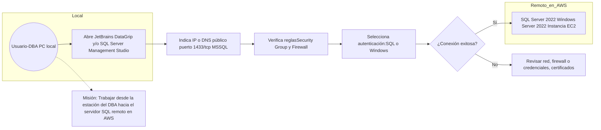

<a href="https://cooltext.com"></a>
<br />Image by <a href="https://cooltext.com">Cool Text: Free Graphics Generator</a> - <a href="https://cooltext.com/Edit-Logo?LogoID=4801693220">Edit Image</a>

# Utilice jetbrains.com DataGrip y/o  SQL Server Manager Studio para acceder a el servidor AWS-MSServer Remoto 1433/tcp para comunicarse con SQL Server 2022 

# 🧑‍🏫  Implementación de Windows Server en AWS EC2 con SQL Server y Consulta Remota desde Cliente Local

### 🎯 Objetivos de Aprendizaje (Learning Objectives)

✅ **AWS EC2** (configuración de instancias, reglas de seguridad, puertos, RDP, etc.)  
✅ **Microsoft SQL Server 2022 Web Edition** (configuración, autenticación, puertos, TCP/IP, acceso remoto)  como server EC2 en AWS
✅ **JetBrains DataGrip** o MS Manager Studio (configuración de conexiones, drivers, autenticación, SSL, etc.)   como cliente
✅ **Conexión de cliente remoto (PC del DBA)** a un servidor SQL en la nube

## 🧰 Requisitos Previos

1. Cuenta activa de AWS Academy.
2. SQL Server Management Studio (SSMS) instalado en equipo local.
3. Cuenta gratuita de LOOM.
4. Acceso a [http://WhatsMyIp.com](http://[whatsismyip](https://www.whatismyip.com) para obtener IP externa.
5. Acceso a [http://fabricate.mockaroo.com](http://fabricate.mockaroo.com) para generar datos ficticios.

-
## Generales
1. ✅ Configurar la **instancia EC2 en AWS** con Windows Server y SQL Server 2022 Web.
2. ✅ Asegurarte que **SQL Server acepte conexiones remotas** (activación de TCP/IP, puertos, autenticación).
3. ✅ Configurar el **grupo de seguridad en AWS** para abrir el puerto 1433/TCP desde tu IP.
4. ✅ Verificar que el **Firewall de Windows** permita el tráfico externo en 1433.
5. ✅ Crear y probar un usuario de SQL Server para autenticación (si usas SQL Auth).
6. ✅ Conectar desde **JetBrains DataGrip**, usando correctamente el driver de SQL Server.

Si ya tienes la instancia activa y necesitas conectar desde DataGrip, dime:

- ¿Tienes la IP pública o DNS de la instancia?  
- ¿Ya habilitaste el puerto 1433 en AWS y en el firewall de Windows?  
- ¿Tienes un usuario y contraseña válidos de SQL Server?

---

---

## 🪜 Paso a Paso

### 1. Crear instancia EC2 con Windows Server y SQL Server

- **AMI sugerida:** Microsoft Windows Server 2022 Base with SQL Server Web.
- **Tipo de instancia:** t2.medium o superior con 8 Gb RAM
- **Almacenamiento:** mínimo 30 GB (C:).
- **Nombre de clave (key pair):** generar uno nuevo o reutilizar existente para RDP.
- **Grupo de seguridad:**
  - Inbound rules:
    - RDP: TCP 3389 desde *My IP*
    - SQL Server: TCP 1433 desde *My IP*

### 2. Conectar por RDP a la instancia

- **Descargar archivo `.rdp`** desde AWS Console.
- Usar contraseña de administrador obtenida mediante clave PEM.

### 3. Habilitar SQL Server para conexiones remotas

Dentro del servidor (vía RDP):

- Abrir **SQL Server Configuration Manager**:
  - Habilitar **TCP/IP** en "SQL Server Network Configuration".
  - En propiedades de TCP/IP, verificar puerto 1433.
- Reiniciar el servicio de SQL Server.

### 4. Crear base de datos y cargar datos ficticios

Aqui se asume que una de las practicas de LLM que tiene en fabricate para reusarla, estamos probando la conexión.

### 5. Configurar IP del cliente en el Security Group

- Ir a checar la ip en su computadora local.
- Copiar IP pública.
- En el **Security Group** de EC2:
  - Editar Inbound Rules → Agregar TCP 1433 desde la IP obtenida (formato: `X.X.X.X/32`).

### 6. Conectarse desde SSMS en la computadora local

- Abrir SSMS o Datagrip.
- En "Server name": `X.X.X.X,1433` (IP pública de la EC2).
- Autenticación: SQL Server Authentication (crear login en SQL Server si no se usa el de Windows).
- Verificar acceso y ejecutar consulta de prueba:
  ```sql
  SELECT TOP 10 * FROM DemoDB.dbo.Clientes; # segun sea el caso
  ```

---

## 🎥 Entrega de Video en LOOM

**Contenido mínimo del video (1 hasta 5 minutos):**
1. Acceso a la instancia EC2 vía RDP.
2. Configuración del firewall con IP pública.
4. Conexión desde SSMS y/o DataGrip en su PC local.
5. Ejecución de una consulta.
6. Mostrar para validar IP de su estacion.
   NOTA: Ud. logró accceder a cualquier server SQL del mundo y trabajar desde su PC
   ¿Que paso con los formularios, etc? estos estaran en el servidor via Aplicacion Web de ASP.net C#

---

## ✅ Criterios de Evaluación

| Criterio                        | Peso |
|-------------------------------|------|
| Instancia funcional            | 20%  ||
| Configuración de red segura   | 20%  |
| Conexión remota exitosa       | 40%  |
| Entrega clara en LOOM         | 20%  |

---

Para conectar JetBrains DataGrip o SQL Server Management Studio (SSMS) a una instancia de SQL Server 2022 en AWS (corriendo sobre Windows Server 2022 con SQL Server 2022 Web), se puede contemplar lo siguiente:

• **Configuración en AWS**  
   - Verificar que el puerto 1433/TCP esté abierto en el grupo de seguridad (Security Group) asociado a la instancia de Windows Server 2022, habilitando las reglas de entrada (inbound rules) para permitir conexiones entrantes en el puerto 1433.  
   - Anotar la dirección IP pública o el DNS público de la instancia de Windows Server. Esa información se muestra en el panel de EC2, en la sección de “Description”, como “Public DNS” o “Elastic IP” (en caso de estar asignada).

• **Acceso por SQL Server Management Studio (SSMS)**  
   - En “Server name” o “Nombre del servidor” se ingresa la IP o DNS público seguido del puerto (si fuera necesario especificarlo explícitamente). Por ejemplo: `mi-direccion-publica:1433`.  
   - Seleccionar el tipo de autenticación correspondiente (SQL Server Authentication o Windows Authentication si hay un dominio/Active Directory con VPN).  
   - Ingresar las credenciales del usuario de SQL Server habilitado para conexiones remotas.  
   - Asegurarse en las propiedades de SQL Server (a través de SQL Server Configuration Manager en la instancia remota) que “TCP/IP” esté habilitado y configurado para el puerto 1433.

• **Acceso por JetBrains DataGrip**  
   - En DataGrip, dentro de “Database Explorer” -> “Data Sources and Drivers”, crear una nueva conexión de tipo “Microsoft SQL Server”.  
   - En “Host” colocar la dirección pública o el DNS de la instancia. En “Port” colocar 1433.  
   - En “Database” se puede dejar en blanco para que muestre todas las disponibles, o colocar directamente la base de datos predeterminada.  
   - Seleccionar el tipo de autenticación (generalmente “User & Password” para SQL Server Authentication).  
   - Habilitar la casilla de “SSL” si fuera necesario (por ejemplo, si el servidor está configurado con un certificado SSL/TLS).  
   - Probar la conexión y, si es correcto, DataGrip indicará “Successful”.

• **Consideraciones adicionales**  
   - Comprobar que el firewall de Windows en la instancia de AWS no bloquee el puerto 1433.  
   - Revisar las propiedades de la instancia de SQL Server para que acepte conexiones remotas (se configura en “SQL Server Network Configuration” habilitando “TCP/IP”).  
   - En SQL Server Management Studio se puede verificar la autenticación mixta (Windows y SQL Server logins) en las propiedades del servidor, opción “Security”.  
   - Asegurarse de tener las credenciales del usuario sa (o el usuario de SQL Server habilitado) que cuente con los permisos adecuados para conectarse remotamente.

De esa forma tanto JetBrains DataGrip como SQL Server Management Studio podrán establecer la conexión con SQL Server 2022 que se encuentra en la instancia de AWS.

---
# SOPORTE TECNICO

Para solucionar problemas de conectividad con Windows Server 2022 y SQL Server 2022 en una instancia de AWS EC2, puedes revisar los siguientes puntos:

1. **Revisar Reglas de Seguridad en AWS (Security Groups)**  
   - Verifica que el Security Group asociado a tu instancia EC2 tenga reglas de entrada (Inbound Rules) que permitan el tráfico en el puerto TCP asociado a SQL Server (por defecto 1433) y que permitan también el tráfico en el puerto RDP (por defecto 3389) si necesitas acceso remoto a la instancia.
   - Asegúrate de que la dirección IP de origen (o rango de IP) esté correctamente configurada para el acceso que necesites.

2. **Revisar la Configuración de la VPC y Subnet**  
   - Confirma que la subred (Subnet) en la que se ubica la instancia EC2 está configurada para permitir tráfico de entrada/salida según tus necesidades.
   - Si requieres conectarte a la base de datos desde Internet, verifica que cuentes con una IP elástica (Elastic IP) asignada y enlazada a la instancia (o algún NAT Gateway o Load Balancer correctamente configurado).

3. **Firewall de Windows Server**  
   - En la instancia de Windows Server, revisa el Firewall de Windows para asegurarte de que las reglas de entrada para SQL Server estén habilitadas (puerto 1433 por defecto) y, si aplica, para el SQL Browser en UDP 1434.
   - Si usas un puerto diferente al 1433, debes ajustar la regla de firewall de forma acorde.

4. **Configuración de SQL Server**  
   - Asegúrate de que la instancia de SQL Server esté configurada para aceptar conexiones remotas. Para verificarlo:
     1. En **SQL Server Configuration Manager** → **SQL Server Network Configuration** → **Protocols for <TuInstancia>**, confirma que el protocolo **TCP/IP** esté habilitado.
     2. Dentro de **TCP/IP** (en las propiedades), comprueba que tengas un puerto estático configurado (por ejemplo, 1433) y que no esté en dinámico (a menos que uses el SQL Browser y un firewall configurado para ello).
     3. Revisa que **SQL Server Services** estén corriendo con la cuenta adecuada y con permisos suficientes.

5. **Verificar la Cadena de Conexión**  
   - Cuando te conectes desde otro equipo (local u otra instancia de EC2), asegúrate de usar la cadena de conexión adecuada:  
     ```
     Server=<IP_Pública_Instancia>,1433;Database=<TuBase>;User Id=<Usuario>;Password=<Contraseña>;
     ```
   - Si se trata de una conexión interna dentro de la misma VPC, utiliza la dirección IP privada o el nombre DNS interno que AWS asigna a la instancia.

6. **Puertos Adicionales y Antivirus**  
   - Si cuentas con antivirus, revisa que no esté bloqueando la comunicación en esos puertos.
   - Asegúrate de no tener software adicional que intercepte el tráfico de red (por ejemplo, VPNs mal configuradas).

7. **Diagnóstico con Herramientas**  
   - Desde un cliente remoto, haz un **ping** a la IP pública (o privada si es intra-VPC) de la instancia. Si no responde, revisa la configuración de ICMP (seguridad y firewall) para ver si está bloqueado.
   - Usa **telnet** (o PowerShell con Test-NetConnection) para confirmar que el puerto 1433 está accesible:
     ```
     telnet <IP_del_Servidor> 1433
     ```
     o
     ```
     Test-NetConnection -ComputerName <IP_del_Servidor> -Port 1433
     ```
     Si marca falla, tienes un bloqueo en seguridad o firewall.
   - Verifica los logs de SQL Server (SQL Server Logs y Event Viewer de Windows) para descartar errores de servicio o de autenticación.

8. **Credenciales y Permisos**  
   - Asegúrate de que las credenciales de SQL Server que usas tengan los permisos adecuados para conectarse desde un cliente remoto.
   - Si usas **Autenticación Windows**, confirma que tengas un **Active Directory** (o el equivalente local) configurado y la comunicación esté habilitada.

9. **Otras Opciones de Conexión**  
   - Considera el uso de **VPN** Site-to-Site o AWS Direct Connect si necesitas una conexión más segura y directa entre tu red corporativa y tu instancia en AWS.
   - Revisa si necesitas configurar un **Bastion Host** o un **Remote Desktop Gateway** para acceder de forma segura.

Si después de revisar estos puntos aún encuentras inconvenientes, se sugiere:
- Consultar los logs detallados de SQL Server para ver cualquier mensaje de error específico.
- Revisar el visor de eventos de Windows para detectar problemas de red, fallos de autenticación o eventos de firewall.
- Confirmar que no existan políticas de grupo (GPO) que bloqueen puertos o protocolos.

Estos pasos abarcan los principales puntos de falla en la conectividad. Si requieres asistencia aún más personalizada, podría ser necesario revisar tu configuración específica en AWS, la instancia de Windows y la configuración avanzada de SQL Server.
